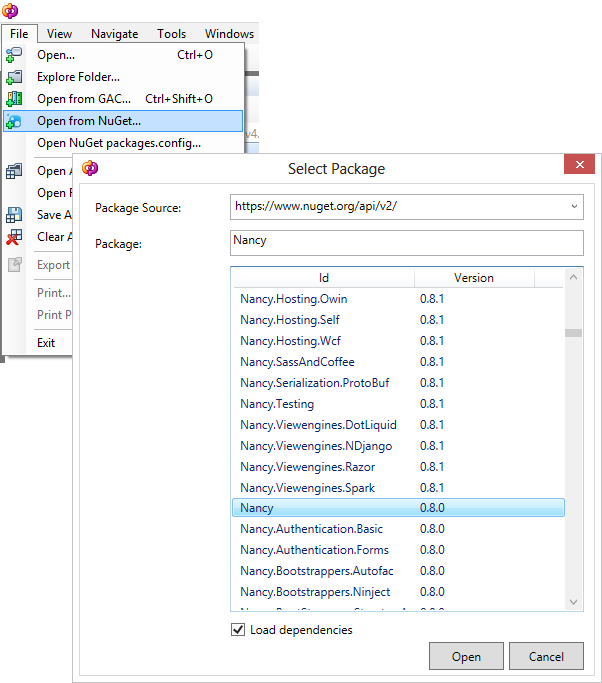

# dotpeek-nupeek

This plugin for dotPeek adds support for loading NuGet packages from any package repository with dotPeek. It supports dotPeek 1.0 and 1.1.

## What does it do? ##

The plugin adds 2 new menu items under dotPeek's File menu:

+ Open from NuGet...
+ Open NuGet packages.config...

Using this plugin, we can search for a NuGet package we want to load and decompile using dotPeek. We can download packages from the official NuGet gallery as well as any other NuGet repository out there such as your TeamCity server.
The _Open NuGet packages.config_ menu item loads all packages from a packages.config file and downloads them from the NuGet repositories specified on your system.

## How do I get it? ##

If you wish to just install a copy of the plugins without building yourself:

- Download the latest zip file: [NuPeek-1.1.zip](https://github.com/JetBrains/dotpeek-nupeek/raw/downloads/downloads/NuPeek-1.1.zip)
- Extract everything
- Run the appropriate batch file for your version of dotPeek, e.g. Install-NuPeek.1.0.bat for dotPeek 1.0, or Install-NuPeek.1.1.bat for dotPeek 1.1.

## Building ##

To build the source, you need the [ReSharper SDK](http://www.jetbrains.com/resharper/download/index.html) installed .

The build.bat file in this repository builds the plugin from scratch. Note that a folder _external_ containing subdirectories _v1.0_ and _v1.1_ must be created and dotPeek assembly files copied in to create the build.

If you only wish to target a specific version of dotPeek, open the appropriate solution file from the repository.

## Contributing ##

Feel free to [raise issues on GitHub](https://github.com/JetBrains/dotpeek-nupeek/issues), or [fork the project](http://help.github.com/fork-a-repo/) and [send a pull request](http://help.github.com/send-pull-requests/).

